# 車載組み込み若手エンジニア向け教材
## 要求とコードの一致性を学ぶ「Event-B × 状態遷移（Stateflow）実践ハンズオン」

---

## 1. はじめに：なぜこの教材を作ったのか？（メンターより）

現場で開発をしていると、次のようなコードやモデルを見かけることがよくあります。

```c
/* 現場でありがちな「場当たり if文」コード */
if (is_up_sw_pressed) {
    motor_up();
}
if (is_pinch_detected) {
    motor_down(); // 挟み込みを検知したらとりあえず下げる...？
}
```

「仕様書に『◯◯のときは××する』と書いてあったから、そのまま `if` 文を足しました」  
一見すると動いているように見えますが、機能が増えたりエッジケースが絡んだ瞬間に、**「要求の集散（仕様があちこちに散らばって誰も全体像を把握できない）」** と **「スパゲッティコード / 破綻したStateflowモデル」** が誕生します。

### 本教材のゴール
1. 仕様書を **「状態（State）」** と **「事象（Event）」** に整理できる。
2. 仕様書を読んだ瞬間に、**Event-B（イベント・ガード・アクション）** の構造が見えるようになる。
3. Event-B の論理がそのまま **UML状態マシン図（Simulink / Stateflowモデル）** に直結することを体感する。
4. **「仕様がコードのように見えてくる（要求と実装の完全一致）」** 感覚を掴む。

---

## 2. 題材：パワーウィンドウ制御の要求仕様書

以下の自然言語の仕様書を題材にします。

| 要求ID | 要求内容 |
| :--- | :--- |
| **REQ-WIN-001** | システムの初期状態は「停止（STOPPED）」とする。 |
| **REQ-WIN-002** | 停止中に「UPスイッチ短押し」された場合、窓が全閉(100%)でなければ「手動上昇（MANUAL_UP）」へ遷移し、モータを上昇駆動する。スイッチが離されたら停止する。 |
| **REQ-WIN-003** | 停止中に「DOWNスイッチ短押し」された場合、窓が全開(0%)でなければ「手動下降（MANUAL_DOWN）」へ遷移し、モータを下降駆動する。スイッチが離されたら停止する。 |
| **REQ-WIN-004** | 停止中にスイッチが「AUTO押下（長押し）」された場合、手を離しても上限端/下限端まで動作を継続する（AUTO_UP / AUTO_DOWN）。 |
| **REQ-WIN-005** | **【最重要安全要求】** 上昇中（MANUAL_UP または AUTO_UP）に「挟み込み（PINCH）」を検知した場合、直ちに「反転下降（PINCH_REVERSING）」へ遷移し、モータを0.5秒間下降駆動した後、停止する。 |
| **REQ-WIN-006** | 動作中に上限端（LIMIT_TOP）または下限端（LIMIT_BOTTOM）に到達した場合、直ちに停止する。 |

---

## 3. Step 0: 数理論理学の最難関「含意 ($P \implies Q$)」を直感で腑に落とす

Event-B や車載機能安全（ISO 26262）の仕様書を書くとき、若手エンジニアが最も引っかかりやすいのが **「含意（Implication: $P \implies Q$、PならばQ）」** です。

日常会話の「ならば」は「因果関係」を連想しがちですが、数理論理学における「含意」は **「前提が起きたときの契約・約束」** です。

| 前提 $P$ (仮定) | 結論 $Q$ (結果) | 命題 $P \implies Q$ | 日常での納得の解釈（約束の視点） | 車載機能安全での意味 |
| :---: | :---: | :---: | :--- | :--- |
| **真 (True)** | **真 (True)** | **真 (True)** | 雨が降り、約束通り傘をさした（文句なし！） | ガードが満たされ、正しく処理された（正常） |
| **真 (True)** | **偽 (False)** | **偽 (False)** ⚠️ | 雨が降ったのに、傘をささなかった（**唯一の約束違反！**） | 上昇中なのに挟み込みを無視した（**重大バグ！**） |
| **偽 (False)** | **真 (True)** | **真 (True)** 🟣 | 雨は降っていないが、傘をさした（日傘かも？約束は破ってない） | モータ停止中に挟み込みが押されても安全（**空虚な真**） |
| **偽 (False)** | **偽 (False)** | **真 (True)** 🟣 | 雨は降っておらず、傘もさしていない（平穏無事） | 前提不成立のため安全ルール違反なし（**空虚な真**） |

### 💡 なぜ「前提が偽」だと命題全体が「真」になるのか？（空虚な真: Vacuous Truth）
「雨が降ったら傘をさす」と約束したとき、**雨が降らなかったら、あなたが傘をさそうがさすまいが『嘘つき（契約違反）』には問えません。**  
「違反していない（破られていない）」のだから、論理的には堂々と **真（合格）** になります。

これを数理論理の等価定理で見ると一発で理解できます：
$$P \implies Q \iff \neg P \lor Q \quad (\text{「Pでない」または「Qである」})$$

教材の [`index.html`](file:///mnt/workspace/projects/Agy_Sample/index.html) の **「Step 0: 含意シミュレータ」** では、この定理を **「並列電気回路」** として視覚化しています：
* スイッチ $\neg P$（Pが起きない）がONになれば、電気が流れて判定ランプが光る！
* スイッチ $Q$（Qが起きる）がONになれば、電気が流れて判定ランプが光る！
* **両方のスイッチが開いて電流が遮断されるのは、「Pが真なのにQが偽」のときだけ！**

> 🎯 **シミュレータで遊んでみよう:**  
> ブラウザで [`index.html`](file:///mnt/workspace/projects/Agy_Sample/index.html) を開くと、**ユーザー自身が好きな自然言語（前提Pと結論Q）を入力して、スイッチをカチカチ動かしながら真偽判定・回路・ベン図・ストーリー解説がリアルタイムに連動する様子** を体感できます！

---

## 4. Step 1: Event-B 思考法（自然言語の分解）

仕様書の文章を、次の **「魔法の3点セット」** に分解してみましょう。

* **EVENT（事象）**: 何が起きたか？（トリガー）
* **GUARD（ガード）**: **どんな状態・条件のときだけ** 受け付けるか？（前提条件）
* **ACTION（アクション）**: 状態や出力をどう更新するか？（結果）

### 例：REQ-WIN-002 を分解する
```text
EVENT: SW_MANUAL_UP (UPスイッチ短押し)
  GUARD:
    - 現在の状態が STOPPED であること
    - 窓の位置が 100%（全閉）未満 であること
  ACTION:
    - 状態を MANUAL_UP に更新する
    - モータ出力を UP にする
```

> 💡 **気づきポイント:**  
> 「もし窓がすでに 100% だったら？」というエッジケースが、**GUARD（前提条件）** を考えることで自然と浮かび上がってきます！

### 安全を守る「不変条件 (Invariant)」
Event-B では、システムが **いかなる時も絶対に破ってはいけない安全ルール** を「不変条件」と呼びます（機能安全 ISO 26262 の核心）。

* **INV-01**: モータの UP と DOWN を同時に ON にしてはならない（短絡・ショート防止）。
* **INV-02**: 挟み込みセンサが反応している間にモータ UP を回してはならない（人身傷害防止）。
* **INV-03**: 窓が全閉(100%)のときにモータ UP を回し続けてはならない（モータ焼損防止）。

---

## 5. Step 2: UML 状態マシン図（Stateflow）へのマッピング

Step 1 で分解した Event-B は、そのまま **UML 状態マシン図（Stateflow の遷移線）** に書き込むことができます。

$$\text{イベント名} \ [\text{ガード条件}] \ / \ \{\text{アクション}\}$$

```mermaid
stateDiagram-v2
    direction TB
    [*] --> STOPPED
    
    STOPPED --> MANUAL_UP : SW_MANUAL_UP [Pos < 100%] / {Motor = UP}
    MANUAL_UP --> STOPPED : SW_RELEASED / {Motor = STOP}
    MANUAL_UP --> STOPPED : LIMIT_TOP / {Motor = STOP}
    
    MANUAL_UP --> PINCH_REVERSING : PINCH_DETECTED / {Motor = DOWN; Timer = 500ms}
    AUTO_UP --> PINCH_REVERSING : PINCH_DETECTED / {Motor = DOWN; Timer = 500ms}
    
    PINCH_REVERSING --> STOPPED : TIMER_TIMEOUT / {Motor = STOP}
    PINCH_REVERSING --> STOPPED : LIMIT_BOTTOM / {Motor = STOP}
```



* **Stateflow の矢印 1 本 1 本が、Event-B の 1 つのイベント定義と完全に一致します。**
* 設計時にこの図を描かずにいきなりモデルを作り始めると、ガード条件が抜けてバグになります。

---

## 6. Step 3: コードへのマッピング（仕様がコードに見える瞬間）

Stateflow の遷移線 1 本は、C言語（マイコンの中）では以下のように動いています：

```c
/* 矢印 1 本分の処理 */
if (current_state == STOPPED && event == SW_MANUAL_UP) {
    if (position_percent < 100) {          /* <-- GUARD (ガード条件) */
        current_state = MANUAL_UP;         /* <-- ACTION (状態遷移) */
        motor_output  = MOTOR_CMD_UP;      /* <-- ACTION (出力制御) */
    }
}
```

TypeScript の型定義（[`src/types.ts`](file:///mnt/workspace/projects/Agy_Sample/src/types.ts)）やステートマシン（[`src/PowerWindowStateMachine.ts`](file:///mnt/workspace/projects/Agy_Sample/src/PowerWindowStateMachine.ts)）を見ると、マジックナンバーを一切使わず、enum とテーブルで綺麗に表現されていることが分かります。

---

## 7. Step 4: グラフィカルシミュレータを動かしてみよう！

本教材には、ブラウザでダブルクリックするだけで動く **グラフィカルシミュレータ** が同梱されています。

### 起動方法
1. ブラウザ（Chrome / Edge 等）で [`index.html`](file:///mnt/workspace/projects/Agy_Sample/index.html) を開きます。
2. インストールや特別なサーバーは不要です。

### 画面の見どころ
* **上部タブ切り替え**:
  * **【Step 0】数理論理「含意（P ⇒ Q）」体感シミュレータ**: 自由入力フォーム、スイッチ、並列電気回路、ベン図、真理値表、リアルタイム自然言語解説。
  * **【Step 1】車載パワーウィンドウ Event-B ＆ 状態マシン**: パワーウィンドウ物理機構、Stateflow状態マシン、操作スイッチ、機能安全（不変条件）監視、自動単体テスト（10項目）。

---

## 8. メンティー向け演習課題（ワークシート）

### 演習 1: 正常系と安全機能の動作確認
1. 「▲ UP 短押し」を押し、窓が上昇することを確認する。
2. 上昇の途中で **「💥 挟み込みを発生させる！(PINCH)」** をクリックする。
   * Stateflow の状態が `PINCH_REVERSING`（赤枠）に遷移したか？
   * 窓が下向きに反転下降し、500ms 後に自動で `STOPPED` に戻ったか？
   * 下部の Event-B ログで `[GUARD OK]` と `[ACTION]` がどう記録されたか確認せよ。

### 演習 2: 「現場のありがち if文 モード」の恐怖を体験する
1. 右パネルの **「現場のありがち if文 モード」** のチェックボックスを ON にする。
2. 「▲ UP 短押し」を押して上昇中に「挟み込み」を押してみよう。
3. **何が起きたか？**
   * 不変条件モニターの `INV-02: 挟み込み時の上昇禁止` が **🚨 FAIL (違反)** になったことを確認せよ。
   * 「状態（今上昇中かどうか）」を無視して適当に書いたコードが、いかに人身事故や重大故障を引き起こすかをディスカッションせよ。

### 演習 3: 新要求の追加（設計チャレンジ）
以下の新しい要求が追加されたとします：
> **REQ-WIN-007**: 「AUTO上昇中またはAUTO下降中に、逆方向のスイッチが短押しされた場合、直ちに動作をキャンセルして停止（STOPPED）する。」

* **問い**:
  * この要求の **EVENT**, **GUARD**, **ACTION** は何か？
  * UML状態マシン図（Stateflow）に新しく引くべき矢印はどこからどこへ向かうか？
