# 要求文書が読める・書けるようになる！状態遷移 × 要求論理 実践ハンズオン
## 有向グラフとブール論理で解き明かす「状態遷移」の思考法

> **💡 すぐに始める方法:**  
> 本教材はブラウザ完結型です。環境構築（Node.js や npm 等）は一切不要です。  
> - **ローカル実行**: レポジトリ内の [`index.html`](file:///mnt/workspace/projects/Agy_Sample/index.html) をお使いのブラウザでダブルクリック（または右クリックでブラウザ起動）するだけ！  
> - **Web実行**: GitHub Pages を有効化すると、ブラウザ上で全章のインタラクティブワーク＆シミュレータが動作します。  
> - **テスト検証**: 画面右上の「🧪 全テスト実行」ボタンから、ドメイン層・ユースケース層・安全不変条件など全21項目の単体テストを即座にブラウザ上で実行・確認できます。

---

## 目次
1. [はじめに：なぜこの教材を作ったのか？（メンターより）](#1-はじめになぜこの教材を作ったのかメンターより)
2. [題材：車載パワーウィンドウ制御の要求仕様書](#2-題材車載パワーウィンドウ制御の要求仕様書)
3. [カリキュラム・ロードマップ（全5ステップ）](#3-カリキュラムロードマップ全5ステップ)
4. [思考のコア理論：形式手法・論理メンタルモデル](#4-思考のコア理論形式手法論理メンタルモデル)
5. [UML 状態マシン図（Stateflow / 有向グラフ）](#5-uml-状態マシン図stateflow--有向グラフ)
6. [アプリケーション設計とアーキテクチャ](#6-アプリケーション設計とアーキテクチャ)
7. [テスト検証環境（ブラウザ ＆ C言語）](#7-テスト検証環境ブラウザ--c言語)
8. [メンティー向け演習課題（ワークシート）](#8-メンティー向け演習課題ワークシート)

---

## 1. はじめに：なぜこの教材を作ったのか？（メンターより）

現場で車載制御や組み込みソフトウェアの開発をしていると、次のようなコードやモデルを頻繁に見かけます。

```c
/* 現場でありがちな「場当たり if文」コード */
if (is_up_sw_pressed) {
    motor_up();
}
if (is_pinch_detected) {
    motor_down(); // 挟み込みを検知したらとりあえず下げる...？
}
```

「仕様書に『◯◯のときは××する』と書いてあったから、そのまま `if` 文を足しました」  
一見すると正常系は動いているように見えますが、機能が増えたりエッジケースや異常系が絡んだ瞬間に、次のような深刻な破綻が起きます：

* **「要求の集散」**: 仕様があちこちの `if` 文に散らばり、システム全体が今どの状態にあるのか誰も把握できない。
* **「スパゲッティコード / 破綻した状態マシン」**: モータの上下が同時に通電してショート（短絡）したり、挟み込みを検知したのに上昇を続けてしまったりする。

### 本教材のゴール
1. 自然言語の仕様書を **「トリガー（前提・事象・ガード）」** と **「アクション（作用）」** に過不足なく解体できる。
2. アクションを「状態の移動」ではなく、**「世界の命題（状態変数）に対する True / False 代入」** として捉えられる（Tell, Don't Ask 原則）。
3. 変数の真偽値の組み合わせから、**「有向グラフとしての状態マシン」** が自然と立ち上がる感覚を掴む。
4. 業界標準の要求仕様記法である **BDD (Given-When-Then)** や **EARS記法**、そして **車載機能安全（ISO 26262）の安全不変条件** が、すべてこの論理モデルの自然な表現であることを実感する。
5. **「仕様がコードに見えてくる（要求と実装の完全一致）」** 自信を獲得する。

---

## 2. 題材：車載パワーウィンドウ制御の要求仕様書

本教材では、車載システムで最も親しみやすく、かつ機能安全（挟み込み防止）の重要性が凝縮された **「パワーウィンドウ制御」** を題材にします。

### 要求仕様一覧
| 要求ID | 要求内容 |
| :--- | :--- |
| **REQ-WIN-001** | システムの初期状態は「停止（STOPPED）」、窓位置は全閉（100%）とする。 |
| **REQ-WIN-002** | 停止中に「UPスイッチ短押し（プル）」された場合、窓が全閉(100%)でなければ「手動上昇（MANUAL_UP）」へ遷移し、モータを上昇駆動する。スイッチが離されたら停止（STOPPED）する。 |
| **REQ-WIN-003** | 停止中に「DOWNスイッチ短押し（プッシュ）」された場合、窓が全開(0%)でなければ「手動下降（MANUAL_DOWN）」へ遷移し、モータを下降駆動する。スイッチが離されたら停止（STOPPED）する。 |
| **REQ-WIN-004** | 停止中にスイッチが「AUTO押下（長押し）」された場合、手を離しても上限端(100%)/下限端(0%)まで動作を継続する（AUTO_UP / AUTO_DOWN）。 |
| **REQ-WIN-005** | **【最重要安全要求】** 上昇中（MANUAL_UP または AUTO_UP）に「挟み込み（PINCH）」を検知した場合、直ちに「反転下降（PINCH_REVERSING）」へ遷移し、モータを0.5秒間下降駆動した後、停止（STOPPED）する。 |
| **REQ-WIN-006** | 動作中に上限端（LIMIT_TOP）または下限端（LIMIT_BOTTOM）に到達した場合、直ちにモータを停止する。 |

### 車載機能安全（ISO 26262）安全不変条件 (Safety Invariants)
システムが稼働中、**「いかなる一瞬たりとも破ってはならない安全ルール」** です。本教材のシミュレータおよびテストスイートでは、これらが常時監視されます。

| 不変条件ID | 安全ルール名 | 論理式 / ガード | 違反時の危険性 |
| :--- | :--- | :--- | :--- |
| **INV-01** | **モータ短絡防止（排他制御）** | $\neg (\text{motor\_up} \land \text{motor\_down})$ | Hブリッジ回路の直結ショート・発煙・基板焼損 |
| **INV-02** | **挟み込み時の上昇禁止** | $\neg (\text{is\_pinched} \land \text{motor\_up})$ | 乗員（首・腕・指）の挟み込みによる重大な人身事故 |
| **INV-03** | **全閉時の上昇禁止** | $\neg (\text{pos} \ge 100\% \land \text{motor\_up})$ | 窓枠への突っ込みによるモータ過負荷・ギア破損・焼損 |
| **INV-04** | **全開時の下降禁止** | $\neg (\text{pos} \le 0\% \land \text{motor\_down})$ | ドア底部への底突きによるリンク機構破損 |

---

## 3. カリキュラム・ロードマップ（全5ステップ）

本アプリケーションは、順を追って自然にメンタルモデルが形成されるよう設計された **全5ステップのロードマップ型 SPA (Single Page Application)** です。


### 🗺️ 各ステップの概要とインタラクティブ機能

#### 🏠 目次ポータル ([`TopPortalView.js`](file:///mnt/workspace/projects/Agy_Sample/js/presentation/views/TopPortalView.js))
* 全5章の学習進捗（完了ステータス、パーセンテージ）をローカルストレージ（LocalStorage）と連携して可視化。
* 画面右上の **「🧪 全テスト実行」** モーダルから、ドメイン層・要求仕様・不変条件・ユースケースの全単体テストをいつでも実行可能。

#### 📘 Step 1: 仕様を解体する「トリガー」と「アクション」 (入門 / 10分)
* **目的**: 自然言語の仕様書を読んでいきなり状態遷移図を描くのをやめ、文章を「もし〜なら（トリガー）」と「〜する（アクション）」に切り分ける基礎体力を養う。
* **ワークショップ内容**:
  * 要求仕様文（REQ-WIN-002, REQ-WIN-005）のフレーズ（トークン）をクリックし、**「トリガー（青）」** または **「アクション（橙）」** に分類。
  * 前提条件（現在の状態）、発生事象（スイッチ操作）、ガード（全閉でないこと）がひとまとめに「トリガー」を構成していることを体感。
  * 判定ボタンで即時採点＆詳細なメンター解説を表示。

#### 📗 Step 2: アクションを「真偽値（True / False）」で捉える (基礎 / 15分)
* **目的**: 「手動上昇状態へ遷移する」と考えると状態数が爆発する。アクションを「世界の命題（状態変数）に対するブール値の代入」として捉える。
* **ワークショップ内容**:
  * 「モータを手動上昇駆動する」「挟み込み検知時の安全反転下降」などのアクションに対し、状態変数（`motor_up`, `motor_down`, `is_auto`, `is_reversing`）を **TRUE** にすべきか **FALSE** にすべきかをテーブルで選択。
  * **Tell, Don't Ask 原則**: 状態変数に対して断定的に値を代入する感覚を身につける。

#### 📙 Step 3: 状態と有向グラフが立ち上がる瞬間 (実践 / 15分)
* **目的**: 「状態マシンは人間が設計するものではなく、変数の真偽値の組み合わせから勝手に立ち上がる」というグラフ理論の真髄を体験する。
* **ワークショップ内容**:
  * 左パネルのトグルスイッチ（`motor_up`, `motor_down`, `is_auto`, `is_pinched`, `is_reversing`）を自由に操作。
  * 右パネルの有向グラフ上で、**変数の組み合わせに対応する状態ノード（STOPPED, MANUAL_UP, AUTO_UP, PINCH_REVERSING等）がリアルタイムにハイライト**。
  * 代表プリセットボタンで、正常状態だけでなく **「⚠️ 危険: モータ短絡 [up=T, down=T]」** や **「⚠️ 危険: 挟み込み中の上昇 [up=T, pinch=T]」** などの異常状態（不変条件違反）を安全に体験。

#### 🚗 Step 4: 車載パワーウィンドウ統合シミュレータ (実践 / 20分)
* **目的**: ここまで学んだすべての理論が、実機の物理挙動・HMI・有向グラフと完全同期して動く様子を体感する。
* **シミュレータの構成**:
  * **車載ドア ＆ 操作スイッチ**: 実車HMI準拠（プル＝閉/上昇、プッシュ＝開/下降、長押しAUTO、挟み込みセンサ作動）。窓ガラスのリアルタイム昇降アニメーション。
  * **リアルタイム有向グラフ**: 現在の状態ノードが発光し、通過した遷移エッジがアニメーション表示。
  * **安全不変条件（ISO 26262）モニター**: INV-01 〜 INV-04 の4項目を常時判定し、PASS / FAIL をリアルタイム表示。
  * **Event-B 遷移＆ガード評価ログ**: イベント発生、ガード成否、アクション、遷移先ノードを時系列で追跡。

#### 🎓 Step 5: BDD・EARS記法の種明かし (発展 / 10分)
* **目的**: 若手が挫折しやすい要求構文「BDD」と「EARS」が、実は Step 1〜3 で学んだメンタルモデルの言い換えに過ぎないことを種明かしする。
* **学習内容**:
  * **BDD (Given-When-Then)** の完全対応（Given = 前提ブール値, When = トリガー事象, Then = True/False代入）。
  * **EARS 5大構文**（State-driven, Event-driven, Unwanted Behavior, Ubiquitous, Optional）の車載パワーウィンドウ仕様への当てはめ。
  * 全カリキュラム修了証の獲得と進捗の確定。

---

## 4. 思考のコア理論：形式手法・論理メンタルモデル

### ① 魔法の3点セット：Event-B 思考法
仕様書の自然言語は、必ず次の3要素に分解できます：

* **EVENT（事象）**: 何が起きたか？（外部トリガー：スイッチ押下、タイマ満了、センサ検知など）
* **GUARD（ガード）**: どんな条件のときだけ受け付けるか？（前提条件：現在の状態、窓位置など）
* **ACTION（アクション）**: どの状態変数をどう書き換えるか？（ブール代入：`motor_up := True` など）

```text
【例: REQ-WIN-002 の Event-B 分解】
EVENT: SW_MANUAL_UP (UPスイッチ短押し)
  GUARD:
    - 現在の状態が STOPPED であること
    - 窓位置 positionPercent < 100% (全閉でない)
  ACTION:
    - 状態を MANUAL_UP に更新
    - motor_up := TRUE
    - motor_down := FALSE
    - is_auto := FALSE
```

### ② 数理論理学の最難関「含意 ($P \implies Q$)」と空虚な真（Vacuous Truth）
機能安全やガード条件で最も重要な論理演算が **「含意（PならばQ）」** です。

$$P \implies Q \iff \neg P \lor Q \quad (\text{「Pでない」または「Qである」})$$

| 前提 $P$ (仮定) | 結論 $Q$ (結果) | 命題 $P \implies Q$ | 約束の視点での解釈 | 車載機能安全での意味 |
| :---: | :---: | :---: | :--- | :--- |
| **真 (True)** | **真 (True)** | **真 (True)** | 雨が降り、約束通り傘をさした | ガード成立、正しく安全処理を実行（正常） |
| **真 (True)** | **偽 (False)** | **偽 (False)** 🚨 | 雨が降ったのに傘をささなかった（**唯一の契約違反！**） | 上昇中に挟み込みを無視した（**重大バグ・事故！**） |
| **偽 (False)** | **真 (True)** | **真 (True)** 🟣 | 雨は降っていないが日傘をさした（契約違反ではない） | 停止中に挟み込みボタンが押されても安全（**空虚な真**） |
| **偽 (False)** | **偽 (False)** | **真 (True)** 🟣 | 雨は降っておらず傘もさしていない（平穏無事） | 前提不成立のため安全ルール違反なし（**空虚な真**） |

> **💡 空虚な真（Vacuous Truth）の納得の極意:**  
> 「雨が降ったら傘をさす」という約束は、**雨が降らなかった日は、あなたが傘をさそうがさすまいが『嘘つき』には問えません。**  
> 「破られていない」以上、論理判定は堂々と **真（合格）** になります。

### ③ BDD (Given-When-Then) との完全一致
| BDD (Gherkin) | 本教材のメンタルモデル | パワーウィンドウでの具体例 (REQ-WIN-002) |
| :--- | :--- | :--- |
| **Given (前提)** | **今、どの変数が True か？（ガード）** | `is_stopped == TRUE ∧ positionPercent < 100%` |
| **When (契機)** | **どのトリガー事象が起きたか？（イベント）** | `SW_MANUAL_UP (UP短押し) が押された瞬間` |
| **Then (結果)** | **どの変数を True/False に変えるか？（アクション）** | `motor_up := TRUE ∧ is_auto := FALSE` |

### ④ EARS記法（5大構文）との完全一致
| EARS構文 | 構文パターン | パワーウィンドウでの適用例 |
| :--- | :--- | :--- |
| **1. State-driven (状態駆動)** | **While** &lt;状態変数がTrueの間&gt;, the system shall &lt;アクション&gt; | **While** 窓が全閉でない間、システムはモータ上昇駆動を維持しなければならない。 |
| **2. Event-driven (事象駆動)** | **When** &lt;トリガーが発生した瞬間&gt;, the system shall &lt;アクション&gt; | **When** UPスイッチが短押しされたとき、システムは手動上昇へ遷移しなければならない。 |
| **3. Unwanted (異常・安全防護)** | **If** &lt;危険・異常条件&gt;, **then** the system shall &lt;安全アクション&gt; | **If** 上昇中に挟み込みを検知した場合、**then** システムは直ちにモータを0.5秒間反転下降させなければならない。 |
| **4. Ubiquitous (普遍安全要求)** | **The system shall** &lt;常に満たすべき不変条件&gt; | **The system shall** モータ上昇と下降を同時にTrueにしてはならない（INV-01）。 |
| **5. Optional (機能選択)** | **Where** &lt;オプション機能が有効な場合&gt;, the system shall &lt;アクション&gt; | **Where** AUTO機能が装備されている場合、長押しで全自動昇降を行わなければならない。 |

---

## 5. UML 状態マシン図（Stateflow / 有向グラフ）

車載パワーウィンドウの有向グラフ構造は以下の通りです。矢印（エッジ）の 1 本 1 本が、**「イベント [ガード] / {アクション}」** に対応します。

```mermaid
stateDiagram-v2
    direction TB
    [*] --> STOPPED : 初期化 [窓位置: 100%]

    %% 手動上昇・下降
    STOPPED --> MANUAL_UP : SW_MANUAL_UP [pos < 100%] / {motor_up := T}
    MANUAL_UP --> STOPPED : SW_RELEASED / {motor_up := F}
    MANUAL_UP --> STOPPED : LIMIT_TOP [pos >= 100%] / {motor_up := F}

    STOPPED --> MANUAL_DOWN : SW_MANUAL_DOWN [pos > 0%] / {motor_down := T}
    MANUAL_DOWN --> STOPPED : SW_RELEASED / {motor_down := F}
    MANUAL_DOWN --> STOPPED : LIMIT_BOTTOM [pos <= 0%] / {motor_down := F}

    %% AUTO上昇・下降
    STOPPED --> AUTO_UP : SW_AUTO_UP [pos < 100%] / {motor_up := T; is_auto := T}
    AUTO_UP --> STOPPED : LIMIT_TOP [pos >= 100%] / {motor_up := F; is_auto := F}

    STOPPED --> AUTO_DOWN : SW_AUTO_DOWN [pos > 0%] / {motor_down := T; is_auto := T}
    AUTO_DOWN --> STOPPED : LIMIT_BOTTOM [pos <= 0%] / {motor_down := F; is_auto := F}

    %% 挟み込み安全反転シーケンス（最重要）
    MANUAL_UP --> PINCH_REVERSING : PINCH_DETECTED / {motor_up := F; motor_down := T; is_reversing := T; timer := 0ms}
    AUTO_UP --> PINCH_REVERSING : PINCH_DETECTED / {motor_up := F; motor_down := T; is_reversing := T; timer := 0ms}

    PINCH_REVERSING --> STOPPED : TIMER_TIMEOUT [timer >= 500ms] / {motor_down := F; is_reversing := F}
    PINCH_REVERSING --> STOPPED : LIMIT_BOTTOM [pos <= 0%] / {motor_down := F; is_reversing := F}
```



---

## 6. アプリケーション設計とアーキテクチャ

本プロジェクトは、ドメイン駆動設計（DDD）およびクリーンアーキテクチャの原則に基づき、保守性・テスタビリティ・移植性を最大化したレイヤード設計を採用しています。

```text
Agy_Sample/
├── index.html                               # SPA エントリーポイント (ビルド不要)
├── index_backup.html                        # 旧モノリス版 HTML バックアップ
├── README.md                                # 本ドキュメント
├── test_suite.c                             # C言語版 単体テストスイート
├── test_suite                               # C言語版 ビルド済み実行可能バイナリ
├── css/                                     # 活版印刷・モダン工学調デザイン
│   ├── main.css                             # 共通トークン・タイポグラフィ・ボタンスタイル
│   ├── portal.css                           # 目次ポータル・ロードマップ・統計カード
│   ├── workbook.css                         # ワークショップ問題カード・トークン・テーブル
│   └── simulator.css                        # ドアSVG・スイッチ・有向グラフ・ログパネル
├── js/                                      # ブラウザ即時実行用 Pure JavaScript
│   ├── domain/                              # 【ドメイン層】純粋モデル・ビジネスロジック
│   │   ├── StateVariable.js                 # 命題・状態変数 (Tell, Don't Ask)
│   │   ├── LogicalFormula.js                # ブール論理式 (AND, OR, NOT, Implication)
│   │   ├── ActionAssignment.js              # 変数代入・複合アクション
│   │   ├── StateNode.js                     # 有向グラフの頂点（状態）
│   │   ├── DirectedEdge.js                  # 有向グラフの遷移矢印（イベント・ガード・アクション）
│   │   ├── SafetyInvariant.js               # ISO 26262 安全不変条件
│   │   ├── DirectedGraph.js                 # 有向グラフディスパッチャ・エンジン
│   │   └── PowerWindowDomain.js             # パワーウィンドウ仕様の定義集約
│   ├── application/                         # 【アプリケーション層】ユースケース
│   │   ├── ExtractRequirementUseCase.js     # Step 1: トリガー/アクション解体判定
│   │   ├── BooleanMappingUseCase.js         # Step 2: ブール代入判定
│   │   ├── GraphDerivationUseCase.js        # Step 3: 変数組み合わせからの状態ノード導出
│   │   └── ProgressUseCase.js               # 学習進捗の算出・完了フラグ管理
│   ├── infrastructure/                      # 【インフラ層】外部ストレージ・データ
│   │   ├── CurriculumData.js                # カリキュラムメタデータ・設問データ
│   │   ├── HashRouter.js                    # ハッシュルーティング (#portal, #ch1〜#ch5)
│   │   └── LocalStorageProgressRepository.js# LocalStorage による進捗永続化
│   └── presentation/                        # 【プレゼンテーション層】UIビュー・コンポーネント
│       ├── App.js                           # アプリケーション起動・ルーター結合
│       ├── components/                      # 共通コンポーネント
│       │   ├── NavigationBar.js             # ヘッダーナビ・進捗・テスト起動
│       │   └── UnitTestModal.js             # 機能別ユニットテスト実行＆結果モーダル
│       └── views/                           # 画面別ビュー
│           ├── TopPortalView.js             # 目次ポータル画面
│           ├── Chapter1ExtractionView.js    # Step 1: 仕様解体ワークショップ
│           ├── Chapter2BooleanView.js       # Step 2: 真偽値化ワークショップ
│           ├── Chapter3GraphDerivationView.js # Step 3: グラフ創発体験画面
│           ├── Chapter4SimulatorView.js     # Step 4: パワーウィンドウ統合シミュレータ
│           └── Chapter5ConclusionView.js    # Step 5: BDD/EARS種明かし画面
└── src/                                     # TypeScript型定義 ＆ 参照実装
    ├── types.ts                             # 車載パワーウィンドウ型定義
    ├── PowerWindowStateMachine.ts           # TypeScript版 Event-B ステートマシン実装
    ├── domain/                              # TypeScript ドメインモデル
    ├── application/                         # TypeScript ユースケース・インターフェース
    └── infrastructure/                      # TypeScript インフラ実装
```

### アーキテクチャの設計原則
1. **フレームワーク・ビルドツール非依存 (Zero Build, Zero Dependency)**:  
   `npm install` や Webpack/Vite などのビルド手順を踏むことなく、[`index.html`](file:///mnt/workspace/projects/Agy_Sample/index.html) をローカルでダブルクリックするだけで直ちに動作します。社内ネットワークの制限が厳しい現場PCでも即座に学習可能です。
2. **純粋ドメインモデルの独立性 (Clean Architecture)**:  
   `js/domain/` 内のロジックは DOM や UI に一切依存しておらず、ブラウザ上だけでなく Headless 環境や Node.js、テストランナーでもそのまま再利用できます。
3. **安全不変条件の分離 (Safety Separation)**:  
   正常系の遷移処理と安全不変条件（Invariants）を完全に分離し、状態遷移の前後に独立して検証するアーキテクチャを採用しています。

---

## 7. テスト検証環境（ブラウザ ＆ C言語）

本リポジトリには、Webブラウザ上の対話型テスト実行機能と、マイコン組み込みを想定したC言語の単体テストの両方が用意されています。

### ① ブラウザ内テストスイート ([`UnitTestModal.js`](file:///mnt/workspace/projects/Agy_Sample/js/presentation/components/UnitTestModal.js))
画面右上の **「🧪 全テスト実行」** ボタンを押すと、ブラウザ上で 4カテゴリ・全21項目の単体テストが即座に実行され、結果がグラフィカルにレポートされます。

* **① ドメイン層: 命題・論理式・アクションモデル (4項目)**:
  * `StateVariable` の Tell 原則とクローン完全性
  * `LogicalFormula` (AND, OR, NOT) の論理値評価
  * `LogicalImplication` の含意 ($P \implies Q$) と空虚な真 (Vacuous Truth) 検証
  * `ActionAssignment` による変数代入と複合アクションの適用
* **② パワーウィンドウ要求仕様 ＆ 状態マシン検証 (8項目)**:
  * REQ-WIN-001: 初期状態（STOPPED / 100%）
  * REQ-WIN-002: 全閉ガードによる UP 短押しの遷移拒絶
  * REQ-WIN-003: 全閉からの DOWN 短押し ➡ MANUAL_DOWN 遷移
  * REQ-WIN-002: 50%からの UP 短押し ➡ MANUAL_UP 遷移
  * REQ-WIN-002: スイッチ離下による停止
  * REQ-WIN-004: AUTO長押しによる自律上昇維持
  * REQ-WIN-005: 上昇中の挟み込み検知 ➡ 直ちに PINCH_REVERSING へ反転下降
  * REQ-WIN-005: 反転タイマ満了（0.5秒）による安全停止
* **③ 車載機能安全 (ISO 26262) 不変条件モニタリング (5項目)**:
  * INV-01: モータ排他制御（短絡防止）
  * INV-02: 挟み込み時の上昇禁止
  * INV-03: 全閉時の上昇禁止
  * INV-04: 全開時の下降禁止
  * 意図的違反検知: モータ短絡（UP=T ∧ DOWN=T）時の FAIL 判定検証
* **④ アプリケーション層: 各ワークショップのユースケース検証 (4項目)**:
  * `ExtractRequirementUseCase`: トリガー/アクション正誤判定
  * `BooleanMappingUseCase`: ブール代入正誤判定
  * `GraphDerivationUseCase`: 真偽値からの状態ノード同定 ＆ 異常検知
  * `ProgressUseCase`: 学習進捗率計算と永続化

### ② C言語 単体テストスイート ([`test_suite.c`](file:///mnt/workspace/projects/Agy_Sample/test_suite.c))
車載ECU（マイコン）での実装を模したC言語コードをビルド・実行して検証できます。

```bash
# ビルド & 実行コマンド
gcc -Wall -Wextra -o test_suite test_suite.c
./test_suite
```

**実行結果の例:**
```text
=================================================================
🧪 車載パワーウィンドウ Event-B ステートマシン C言語 単体テスト
=================================================================
  ✅ Test 01 PASS: [REQ-WIN-001] 初期状態は STOPPED かつ モータ停止
  ✅ Test 02 PASS: [REQ-WIN-002] 停止中に SW_MANUAL_UP で MANUAL_UP & モータUP
  ✅ Test 03 PASS: [REQ-WIN-002] MANUAL_UP中にスイッチ離下で STOPPED 復帰
  ✅ Test 04 PASS: [REQ-WIN-003] 停止中に SW_MANUAL_DOWN で MANUAL_DOWN & モータDOWN
  ✅ Test 05 PASS: [REQ-WIN-004] AUTO_UP はスイッチ離下後も AUTO_UP を維持
  ✅ Test 06 PASS: [REQ-WIN-005] 上昇中に挟み込み検知で直ちに反転下降(DOWN)へ遷移
  ✅ Test 07 PASS: [REQ-WIN-005] 反転タイマ満了で安全に STOPPED 復帰
  ✅ Test 08 PASS: [REQ-WIN-006] 上限端到達(LIMIT_TOP)でモータ停止 & 100%保持
  ✅ Test 09 PASS: [ガード検証] 全閉(100%)時は SW_MANUAL_UP がガードで弾かれSTOPPED維持
  ✅ Test 10 PASS: [キャンセル仕様] AUTO_DOWN中に逆方向スイッチ(UP)でキャンセル停止
=================================================================
🎉 全10テストケース PASS: 要求仕様・安全不変条件との完全一致を確認!
=================================================================
```

---

## 8. メンティー向け演習課題（ワークシート）

教育研修やOJTで本教材を活用する際は、以下のワークシートに沿って受講者とディスカッションを行ってください。

### 📝 演習 1: 自然言語の解体（Step 1 実践）
1. ブラウザで [`index.html`](file:///mnt/workspace/projects/Agy_Sample/index.html) を開き、**Step 1** にアクセスする。
2. 設問 1（REQ-WIN-002）と設問 2（REQ-WIN-005）のフレーズを分類してみよう。
3. **問い**:
   * なぜ「停止中に」や「窓が全閉でなければ」をトリガー（前提・ガード）に分類する必要があるのか？
   * これらを考えずに「UPボタンが押されたら上昇」とだけ実装すると、実機でどのような不具合が起きるか？

### 📝 演習 2: 状態変数へのブール代入（Step 2 実践）
1. **Step 2** の設問 2（挟み込み検知時の安全反転下降）を開く。
2. `motor_up`, `motor_down`, `is_reversing` の真偽値をセットしてみよう。
3. **問い**:
   * なぜ `motor_down := TRUE` にするだけでなく、明示的に `motor_up := FALSE` を代入する必要があるのか？（ハードウェア回路の視点から考察せよ）

### 📝 演習 3: 危険状態の特定とグラフ創発（Step 3 実践）
1. **Step 3** のトグルスイッチで、`motor_up` と `motor_down` の両方を TRUE にしてみよう。
   * 右パネルのバナーに何が表示されたか？
2. プリセットボタンの **「⚠️ 危険: 挟み込み中の上昇」** をクリックしてみよう。
   * どの不変条件（INV）に違反しているか確認せよ。
3. **問い**:
   * 現場で「場当たり if文」を書いたとき、なぜこのような危険な変数の組み合わせが生じてしまうのか？

### 📝 演習 4: 実機シミュレーション ＆ 挟み込み安全シーケンス（Step 4 実践）
1. **Step 4** のシミュレータを開く。初期状態は窓位置 100%（全閉）である。
2. 「▲ プル 短押し」を押してみよう。
   * なぜ窓が上がらないのか？ 右パネルのログに何と表示されたか確認せよ（ガード拒絶 `LIMIT_TOP`）。
3. 「▼ プッシュ 短押し」で窓を 50% 程度まで開け、手を離して停止させる。
4. 「▲▲ プル 長押し（AUTO 全閉）」を押し、窓が自動上昇を始めたら、すかさず **「⚡ 挟み込み（PINCH）を検知！」** をクリックする。
   * 有向グラフ上のノードがどこへ移動したか？
   * 窓ガラスは何秒間、どちらへ動いた後、どの状態へ戻ったか？
   * 右パネルの不変条件モニタ（INV-01〜04）がすべて PASS のまま保たれたか確認せよ。

### 📝 演習 5: 新規安全要求の設計チャレンジ（Step 5 発展）
以下の新しい要求が顧客から追加されたとします：

> **新規要求 REQ-WIN-007**:  
> 「AUTO上昇中またはAUTO下降中に、ユーザが逆方向のスイッチを操作した場合、直ちに動作をキャンセルして停止（STOPPED）すること。」

* **問い**:
  1. この要求を **Event-B（EVENT, GUARD, ACTION）** で定義せよ。
  2. この要求を **BDD (Given, When, Then)** の文式で記述せよ。
  3. この要求を **EARS記法（State-driven または Event-driven）** で記述せよ。
  4. UML状態マシン図（有向グラフ）において、どのノードからどのノードへ新しい矢印を引けばよいか図示せよ。
